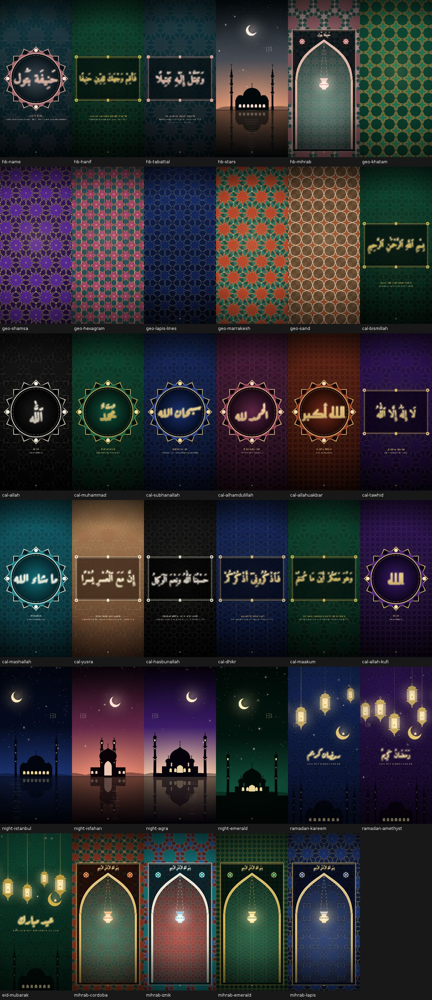
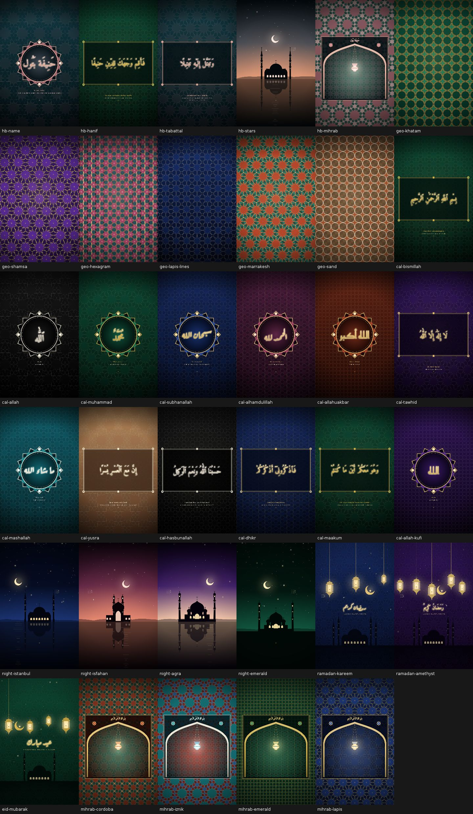
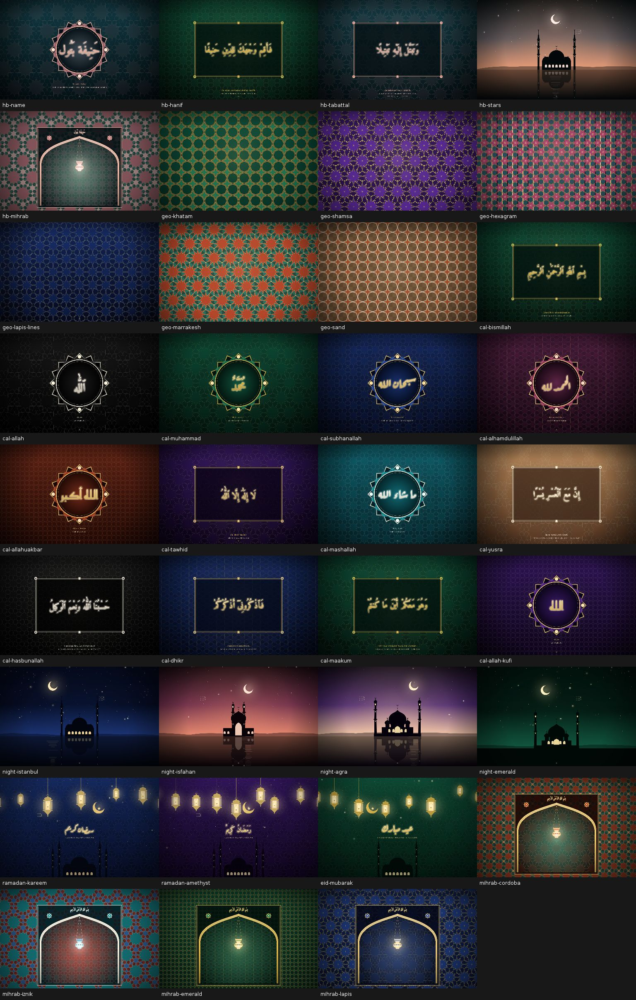

# noor by HBS — Islamic wallpapers and prayer times, made for Hanife Betül

An Android app that draws Islamic art on the device at its native resolution, so
no artwork is downloaded and nothing is upscaled. It is also a daily companion:
**Diyanet's prayer times** with notifications, a home-screen widget and the
times on the live wallpaper, a **qibla compass**, a **tesbih counter** and a
**Hijri calendar** of religious days. It is tuned for the
**OPPO Find X9 Pro** (6.78" LTPO OLED, **1272 × 2772**, ColorOS 16 / Android 16)
and works on any Android 10+ phone or **tablet**.

The app is in **Turkish**, wallpaper captions included: category and design
names, Turkish readings of each phrase (*Bismillâhirrahmânirrahîm*,
*Elhamdülillah*…), and meanings with Turkish surah names (*İnşirah 94:6*). The
Ramazan and Bayram scenes say *Hayırlı Ramazanlar* and *Bayramınız Mübarek
Olsun*. The Arabic calligraphy stays Arabic.



## Every day: Vakitler, Kıble, Zikir, Takvim

The app opens on **Galeri**, the wallpapers. Five tabs sit along the bottom:
Galeri, Vakitler, Kıble, Zikir and Takvim. Out of the box everything is set for
**Pendik, İstanbul**, with no location prompt; another place can be picked in
*Ayarlar*.

- **Prayer times from Diyanet.** These are T.C. Diyanet İşleri Başkanlığı's official
  tables, fetched through the public *ezanvakti* service, which republishes them
  as JSON. Pick a country, city and district from Diyanet's own lists, or tap
  *Konumumu bul*: the app takes a coarse location fix, reverse-geocodes it and
  selects your district in Diyanet's list.
  Each table covers about a month and is cached on the device, with a background
  refresh before it runs out.
- **Works offline.** With no internet, pick one of the 81 provinces and the times
  are calculated with Diyanet's method: İmsak at 18° below the horizon, Yatsı at
  17°, and Diyanet's temkin margins (Güneş −7, Öğle +5, İkindi +4, Akşam +7
  minutes). Once Diyanet's own table has been seen, the calculation is
  calibrated against it, so any days beyond the cached table still match
  Diyanet's numbers closely. The screen always says which source it is showing.
- **The Vakitler screen.** A ticking countdown to the next time. Today's six times
  with the current one highlighted. The Hijri date, Diyanet's *kıble saati*, the
  next religious day and the monthly *İmsakiye*. A note of the day (a Qur'anic
  verse or a few words for her). Behind it all, a design that follows the time of
  day: dawn over Pendik Marina at İmsak, İznik tiles through the morning and
  noon, the sun setting behind the Princes' Islands at Akşam and Pendik's shore
  by night at Yatsı. On a kandil night the minarets are lit.
- **Notifications.** Pick which times notify. A reminder can come 5 to 45 minutes
  before. During Ramadan, İmsak and Akşam notifications are worded for sahur and
  iftar. Kandil nights are greeted at Akşam and Bayrams at sunrise. Alarms are
  exact when Android allows, and they are set up again after a restart or a
  clock change.
- **Home-screen widget.** Shows the next time with a live countdown and all six
  times, drawn over any design: choose *Vakit widget'ının arka planı* when you
  apply a design.
- **On the live wallpaper.** An optional gilded panel shows the next time, or all
  six. Turn on *Vakte göre değişen tasarım* and the wallpaper changes design from
  dawn to night.
- **Kıble.** A compass corrected for magnetic declination, with the Kaaba on the
  dial. It shows the distance to Mecca and the kıble saati for days the compass
  is unreliable.
- **Zikir.** A tesbih counter with post-prayer *tesbihat* (33 × 3, then the closing
  tevhid) and other dhikr. Each count gives a light tick, and a round's end a
  stronger one. The volume keys count too.
- **Takvim.** A month grid with each Hijri day under its date, and Diyanet's
  religious days for the year ahead: the three months, Regaib, Miraç, Berat,
  Ramadan, Kadir, the two Bayrams with their arefe, the Hijri new year, Aşure
  and Mevlid. The Hijri calendar is Umm al-Qura, nudged by a day where needed to
  agree with the Hijri dates in Diyanet's table.

## Make it yours

- **Your own palette.** In any design, tap **+** in the palette row and pick a
  background, an ornament (gold) and an accent, or tap *Zar at* for a random
  harmony. The design behind the sheet redraws as you pick. Saved palettes work
  on every design.
- **Ayarla** (✎). Show or hide the Turkish reading and meaning under the
  calligraphy, change how much paper texture shows, and darken the wallpaper
  for legibility or for an OLED screen.
- **Kendi Sözün.** Write your own words and the app sets them in Amiri on a
  levha, with an ebru margin, gilded corners and the ح ب seal.
- **App colours.** Choose any palette, including your own, in *Ayarlar*.
- **A new wallpaper every day.** It is picked from your favourites, her
  collection or everything, with a fresh arrangement each day.
- **Döngü: up to ten wallpapers in turn.** Tap ↻ above the gallery, tick up to
  ten designs (with your own palettes and settings) and choose how often they
  change: every 10 minutes, every hour or every day, on the home screen, the
  lock screen or both, or on the **live wallpaper**: there the designs fade
  from one to the next with the stars, shooting stars and prayer panel still
  on top (the app offers to set the live wallpaper if it isn't already). Changes land on the clock (10:00, 10:10…; on the hour;
  at midnight), survive restarts, and catch up if the phone was asleep. It
  replaces the daily wallpaper while it runs; stop or edit it in the gallery or
  in *Ayarlar*. A popup introduces it the first time the app opens.

## 2.1: name, icons, motion

- The app is called **noor by HBS**. Its launcher icon can be changed in
  *Ayarlar › Görünüm*: Zümrüt (the original), Betül, Hilâl, Nur or Marmara.
  Each is an `<activity-alias>`; switching enables one and disables the rest,
  and the launcher picks it up within a few seconds.
- Things move: cards give under the finger, pictures fade in, the gallery
  re-flows when the category changes, the countdown rolls like a flip clock,
  the tesbih beads tug with every count, and screens rise and sink as they
  open and close.
- A hidden surprise for her birthday (12 September 2000): tap that day in
  Takvim, marked only with a tiny ♡, or open the app on her birthday. It tells
  her about the day she was born and unlocks **Doğduğun Gece**, the sky over
  the Marmara that night with the moon as it really was (99%, a day before
  full). It is not announced in the "Yeni" popups on purpose.

## Gerçek Camiler: real photographs

Next to the drawn designs, the **📷 Gerçek Camiler** tab shows real photographs
of mosques and Islamic architecture: **Pendik first** (its mosques, its shore,
Kurtköy and Kaynarca), then a handful of İstanbul's great mosques (Büyük
Çamlıca, Süleymaniye, Sultanahmet, Ayasofya, Ortaköy, Rüstem Paşa, Mihrimah
Sultan), then the wider world: Mecca, Medina, Jerusalem, Edirne, Bursa,
Divriği, Abu Dhabi, Muscat, Casablanca, Kairouan, Córdoba, the Alhambra,
Damascus, Cairo, Isfahan, Shiraz, Samarkand, Lahore, Islamabad, Agra, Djenné
and Brunei.

- The photos come from **Wikimedia Commons** and are freely licensed (CC BY,
  CC BY-SA, CC0 or public domain; nothing non-commercial or no-derivatives).
  Each one shows its photographer and licence, and links to its Commons page.
- For each place the app searches Commons and prefers Featured, Quality and
  Valued pictures, then upright, high-resolution shots, skipping maps, plans,
  panoramas and small files.
- They need the internet once. The search results are kept for a month,
  and a photo stays on the phone once downloaded. It is cropped to the exact
  screen size, not stretched.
- A photo can be set on the home screen, the lock screen or both, and picked for
  **Döngü** alongside the drawn designs, including on the live wallpaper (where
  the prayer panel shows over it, without the painted stars).

## For Hanife Betül

The app was made for Hanife Betül, and it's full of not-so-secret easter eggs
for her (in Turkish):

- **Her own collection**, first in the gallery: her name in a calligraphy
  medallion, and the two verses her names come from. *Hanîf* is in Rûm 30:30.
  *Betül* shares its root with *tebettül* in Müzzemmil 73:8. The collection
  also has a dusk mosque, a "Nur" lantern scene (*Yolun nur olsun, Hanife Betül*), a mihrab with her name
  inscribed, and a rosette.
- **A "Hanife Betül" palette** (rose gold, deep teal, dusty rose and sage) that
  works on every design.
- **An "HB" constellation** hidden in every night sky and lantern scene, and a
  tiny **H·B star** at the foot of every wallpaper.
- **A shooting star** in the live wallpaper every 37 seconds. Make a wish.
- **Greetings** in the header: time-of-day greetings, Friday greetings (Hayırlı
  Cumalar), and Ramadan and Eid greetings worked out from the Hijri calendar.
- **A welcome note** on first launch. A **✦ button** (or five taps on the
  "noor by HBS" title) opens a dedication page explaining what her names mean.
- **Personal messages** when she sets a wallpaper, a compliment on every
  seventh shuffle, and a personal note when her favourites list is empty.
- **Her page (✦).** It shows what her names mean and their *ebced* (abjad) value:
  حنيفة 153 + بتول 438 = **591**. She can save her birthday there. It also keeps a
  tracker of **17 surprises**, with a hint for each one not found yet.
- **Her birthday.** The app greets her that day. The daily wallpaper becomes the
  *Doğum Günün* design, and rose petals fall on the live wallpaper.
- **A secret design.** Count to 591 on the tesbih and the gallery opens
  *Lâle · Hilâl · Allah*: an İznik tulip under a crescent, with الله above. In
  Ottoman letters لاله, هلال and الله use the same letters, so each is worth 66.
- **Touch the live wallpaper** and a star shoots from your fingertip.
- **More of her collection.** Her own words (*Kendi Sözün*), her name in Rik'a and
  Kûfî, and the Nûr verse (24:35), the *noor* in noor by HBS.
- **Long-press ✦** to paint the whole app in her rose-gold and teal.
- **Personal lines** in notifications, the qibla compass and the tesbih (153, 438,
  591 and 99 each have a message).

## Phones and tablets

The target tablet is the **Samsung Galaxy Tab S9 FE** (10.9" LCD, 2304 × 1440). The previews below are rendered at that resolution.

On a phone the wallpaper is rendered at the exact panel size. A tablet can be
held either way up, so the app renders a square wallpaper as wide as the
panel's long side. The main subject sits in the centred square that stays
visible in both orientations, and the background fills the rest. The live
wallpaper redraws itself for each orientation.

| Tablet, portrait | Tablet, landscape |
|---|---|
|  |  |

## What's inside

| Category | Designs |
|---|---|
| **Geometric** | Star patterns built with Hankin's *polygons-in-contact* method over five tilings: Khatam, Rub el Hizb, Shamsa, twelvefold Rosette and Hexagram. Each comes in three styles: gold strapwork, Fez/Marrakesh zellige, and OLED-friendly gold linework. |
| **Calligraphy** | Bismillah, Allah, Muhammad, SubhanAllah, Alhamdulillah, Allahu Akbar, the Tawhid, MashaAllah, and verses 94:6, 3:173, 2:152 and 57:4. Set in Naskh (Amiri), Ruqaa (Aref Ruqaa) and Kufi (Reem Kufi), each with a transliteration and its meaning. |
| **Night Mosques** | Procedural Ottoman, Persian and Mughal mosque silhouettes under night, dusk or dawn skies. Lit windows, a crescent moon, and optional reflections in water. |
| **Ramazan ve Bayram** | Hanging fanous lanterns, a crescent, and رمضان كريم / عيد مبارك calligraphy captioned *Hayırlı Ramazanlar* / *Bayramınız Mübarek Olsun*. |
| **Mihrab** | A tiled wall with a gilded pointed arch, a Bismillah inscription and a glowing Mamluk glass lamp. |
| **Ebru** | Turkish paper marbling, simulated the way a marbler works the tray: drops spreading on size water, then the stylus and comb. Battal, Gelgit, Şal, Taraklı and Bülbül yuvası, in hand-mixed pigment sets. |
| **Levha** | Hat levhası: ink calligraphy on aged ahar paper with gold cetvel rules, gilded corner pieces, an ebru margin and a red seal with Hanife Betül's initials. Gold-on-black *zerendüd* in the Onyx palette. |
| **Suluboya** | Watercolour İstanbul mosque paintings: dawn, sunset, crescent night, mist, rain, snow, tulips, and a Kandil night with lit minarets. |
| **Çini** | Hand-painted İznik tiles: vase panels, tulip, carnation, saz and rumi repeats, with glaze, grout and imperfections. |
| **Pendik** | Her home on the Marmara: the sun going down behind the Princes' Islands, dawn at Pendik Marina and the shore by night in watercolour, a ferry-and-gulls poster, Pendik from Aydos hill among the stone pines, a Ramadan *mahya* strung between the minarets (its words can be changed to hers), the qibla from Pendik (152°, 2,382 km), Rahmân 55:24 on ships as a levha, and Marmara ebru and çini. Each also appears in the tab for its kind of art, so every tab has a little Pendik in it. |
| **Hanife Betül ♡** | Her name in Naskh, Rik'a and Kûfî, her two verses, the Nûr verse, her night, lantern, mihrab and rosette, *Kendi Sözün* for her own words, a birthday design, and one more that has to be found. |

There are 103 designs (and one hidden), and each can use any of the **10 palettes** or one of hers: Hanife Betül,
Zümrüt ve Altın, Gece Lâciverdi, İznik Turkuazı, Çöl Kumu, İsfahan Gülü,
Elhamra Kiremidi, Oniks ve İnci (true black for OLED), Saray Ametisti and
Marmara Akşamı (sea blue and island-dusk coral).
**Shuffle**
re-seeds the design (moon position, lantern layout, mosque details and so on).

On the detail screen you can:

- **Set wallpaper** on the home screen, the lock screen or both. The bitmap is
  rendered at the exact panel size, so ColorOS doesn't crop or scroll it.
- Pick **Live wallpaper** for the same design with slowly twinkling stars and a
  drifting band of light. It animates only while visible, at 20 fps.
- **Save** a PNG to `Pictures/noor by HBS` (no storage permission needed).
- Add designs to **Favourites**. Your palette and seed choices are remembered for
  each design.

## Install

**Download the APK from [Releases](https://github.com/genclinux/burnthoseclaudelimits/releases/latest)**
(`noor by HBS-v1.0.x.apk`), open it on the tablet, and allow *Install unknown apps*
when asked. Every release is signed with the same key, so newer versions
install as updates.

To cut a new release, bump `versionCode`/`versionName` in `app/build.gradle.kts`
and either push a tag (`git tag v1.0.1 && git push origin v1.0.1`) or run the
**Android build** workflow by hand from the Actions tab with `release_tag` set to `v1.0.1`.

Builds from other pushes are also available as CI artifacts:

Every push builds an APK in GitHub Actions (**Actions → Android build →
`hbsnoor-apk` artifact**). `app-release.apk` is minified and signed with the
debug key, so it installs directly:

1. On the Find X9 Pro, open the APK and allow *Install unknown apps* for your
   browser or file manager when ColorOS asks.
2. Open **noor by HBS**, choose a design, then tap **Duvar kağıdı yap** (Set wallpaper).

To build it yourself, use JDK 17 and the Android SDK (API 36):

```bash
./gradlew assembleRelease   # app/build/outputs/apk/release/app-release.apk
./gradlew testDebugUnitTest # geometry, prayer-time and customisation tests
```

## How it works

```
app/src/main/java/com/noor/wallpapers/
├── prayer/       Pure Kotlin prayer times: Diyanet parsing, Diyanet-method calculator
│                 with calibration, schedule and alarm triggers, qibla, provinces,
│                 religious days, the live-wallpaper prayer panel
├── service/      Android: Diyanet HTTP + cache, settings, exact alarms, notifications,
│                 widget, WorkManager jobs, location
├── art/          Pure Kotlin scene engine (no Android imports)
│   ├── StarPatterns.kt   tilings + Hankin construction
│   ├── GeometricArt.kt   strapwork / zellige / linework styles
│   ├── CalligraphyArt.kt phrases, medallion and frame
│   ├── NightArt.kt       sky, moon, procedural mosque silhouettes
│   ├── LanternArt.kt     Ramadan & Eid lanterns
│   ├── MihrabArt.kt      niche, arch, lamp
│   ├── Ambient.kt        live-wallpaper animation layer
│   └── Catalog.kt        the gallery
├── wallpaper/    Android renderer, WallpaperManager / MediaStore, live wallpaper service
└── ui/           Jetpack Compose gallery and detail screens
```

Each design emits a `Scene`, which is a list of paths, gradients and text in a
platform-neutral form. On the phone, `AndroidRenderer` draws it onto a `Canvas`.
`tools/preview` draws the same scenes with Java2D, so you can work on the art
on any desktop JVM, no Android SDK needed:

```bash
gradle -p tools/preview run -Pscale=0.5   # phone + tablet PNGs and contact sheets in tools/preview/build/previews
gradle -p tools/preview run -Pdevice=tablet_landscape -Ponly=hb
gradle -p tools/preview test              # same engine tests, on plain JVM
```

## Credits

The fonts are bundled under the SIL Open Font License 1.1. Their licence texts
are in `app/src/main/assets/fonts/`:

- [Amiri](https://github.com/aliftype/amiri) by Khaled Hosny
- [Aref Ruqaa](https://github.com/aliftype/aref-ruqaa)
- [Reem Kufi](https://github.com/aliftype/reem-kufi)

The app generates all the artwork itself. It contains no third-party images.

Prayer times are T.C. Diyanet İşleri Başkanlığı's, retrieved through the public
ezanvakti service. The offline calculation uses the solar model from
PrayTimes.org with Diyanet's parameters; its tests compare it against the NOAA
algorithms (via the Python `astral` package). The religious-day rules are tested
against Diyanet's published 2025 calendar.
